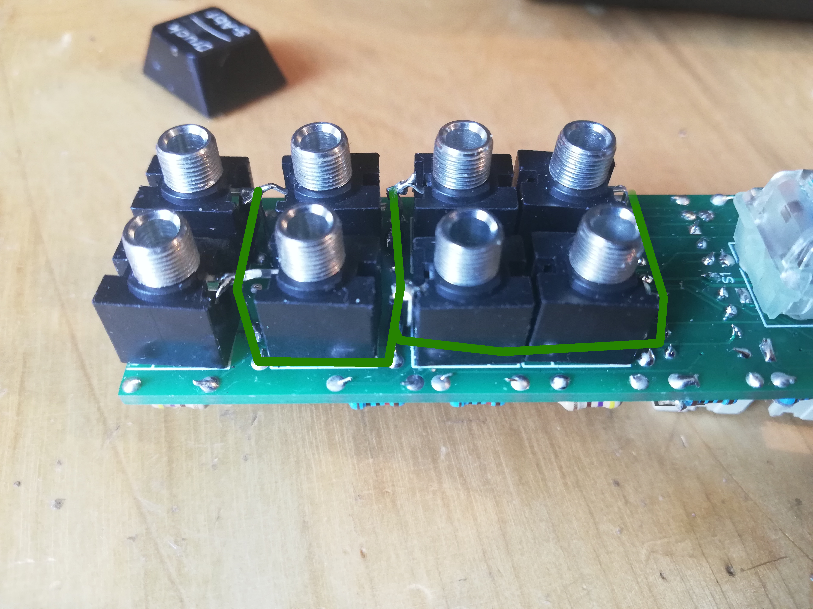

# HAGIWO-040-VCS-Eurorack

Through-hole PCB version of the [HAGIWO 040 "Select" Voltage controlled Switch Eurorack module](https://www.youtube.com/watch?v=aYyemBHd6mM&t=15s).
The module is basically built around an analog switch IC that allows you to direct one channel of a signal in one of two "output channels" depending on button presses or a control voltage.

I made the change to switch the IC to a DG211/DG411, since those are far more available to me. I also made the change to replace the threshold potentiometer in the front with a trimmer in the back, but also the trimmers are unique for each channel.

### CAUTION: CONFIRMED WORKING, currently on version 3. If you have ordered an older version, be sure to double check the ground connection.

## PCB and Hardware

You can find the schematic and BOM in the root folder. 
For the PCBs, the module has one circuit PCB and one panel PCB. You can order them on any common PCB manufacturing service, I used JLCPCB. Standard settings should be fine.

Probably the only part that is a bit special about the BOM in this are the switches: I made the choice to switch the standard push switches HAGIWO uses to CHERRY MX switches.
They are bigger, sure, but they are also far more satisfying and everyone can [insert their favourite type](https://switchandclick.com/wp-content/uploads/2020/07/Cherry-MX-Switch-Guide-1-1024x679.webp). Make sure to get the "RGB" option which has space for the LED indicator. I got the wrong ones and had to kinda bend the bottom of mine to make the LED fit.

For the build, since I had to fit it all on one pcb and it is kind of crowded, the jacks don't all have room. You have to connect the ground connections on some of them together like this:

