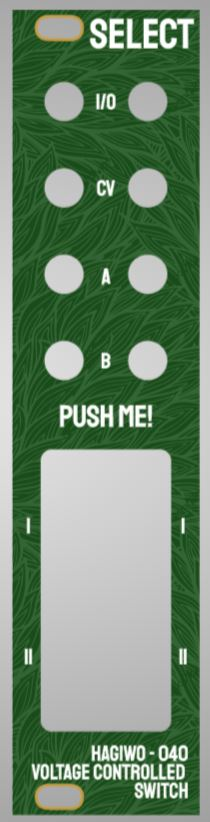

# HAGIWO-040-VCS-Eurorack

Through-hole PCB version of the [HAGIWO 040 "Select" Voltage controlled Switch Eurorack module](https://www.youtube.com/watch?v=aYyemBHd6mM) .
The module is basically built around an analog switch IC that allows you to direct one channel of a signal in one of two "output channels" depending on button presses or a control voltage.

I made the change to switch the IC to a DG211/DG411, since those are far more available to me. I also made the change to replace the threshold potentiometer in the front with a trimmer in the back, but also the trimmers are unique for each channel.

### STATUS: Now on version 4 with improved spacing on the panel and pcb. 

## PCB and Hardware

You can find the schematic and BOM in the root folder. 
For the PCBs, the module has one circuit PCB and one panel PCB. You can order them on any common PCB manufacturing service, I used JLCPCB. Standard settings should be fine.

Probably the only part that is a bit special about the BOM in this are the switches: I made the choice to switch the standard push switches HAGIWO uses to CHERRY MX switches.
They are bigger, sure, but they are also far more satisfying and everyone can [insert their favourite type](https://switchandclick.com/wp-content/uploads/2020/07/Cherry-MX-Switch-Guide-1-1024x679.webp), I vote for clicky blues! Make sure to get the "RGB" option which has space for the LED indicator. I got the wrong ones and had to kinda bend the bottom of mine to make the LED fit.

For the build, the PCB is very crowded since i tried to fit everything on one PCB. in former revisions there was a problem with jack spacing, but this has been solved. for earlier versions see the commit history.

## Tuning
The module has two trimpots which you can use to set the trigger voltage for each channel. The easiest way to set these imo is to feed it the voltage you want (say 2.5V) and then adjust the trimpot until the point where it barely triggers a channel change. I have mine set to different voltages (1V and 2V) so that I can feed the same lfo into both and get different timing from it, but do as you prefer!
